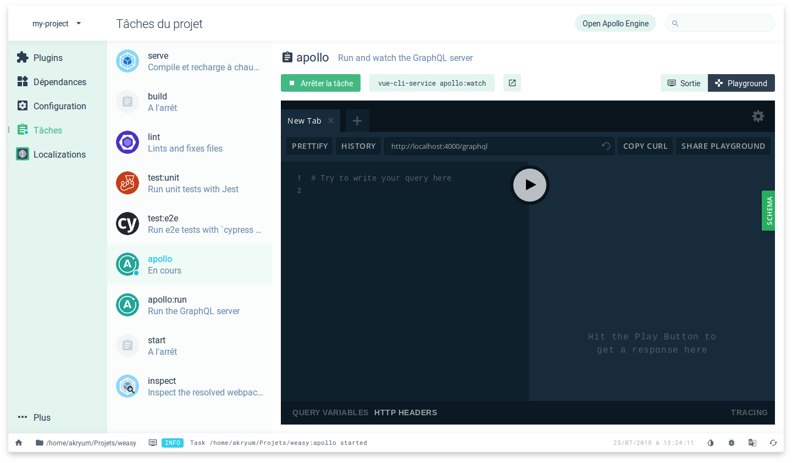

# vue-cli-plugin-apollo

**:rocket: Start building a Vue app with Apollo and GraphQL in 2 minutes!**

This is a vue-cli 3.x plugin to add Apollo and GraphQL in your Vue project.

  

 

<h3 align="center"><a href="https://vue-cli-plugin-apollo.netlify.com/">Documentation</a></h3>

 

## Sponsors

### Gold

  

### Silver

  

  

### Bronze

  

  

 

 

## :star: Features

- Automatically integrate [vue-apollo](https://github.com/Akryum/vue-apollo) into your Vue app
- Embed Apollo client config (upgradable and customizable)
  - Websockets
  - File uploads
  - Client state with [apollo-link-state](https://github.com/apollographql/apollo-link-state)
- Included optional Graphql Server (upgradable and customizable):
  - Dead simple GraphQL API sources generated into your project (with import/export support)
  - Upgradable service running [apollo-server](https://www.apollographql.com/docs/apollo-server/)
  - Websocket subscriptions support
  - Optional automatic mocking
  - [Apollo Engine](https://www.apollographql.com/engine) support
  - GraphQL playground integrated in the CLI UI
  - Configuration screen in the CLI UI
  - Server-Side Rendering with [@akryum/vue-cli-plugin-ssr](https://github.com/Akryum/vue-cli-plugin-ssr)
- Included optional example component with:
  - Watched query
  - Mutation
  - Realtime subscription using Websockets
  - Fully working image gallery with image upload
- GraphQL validation using ESLint
